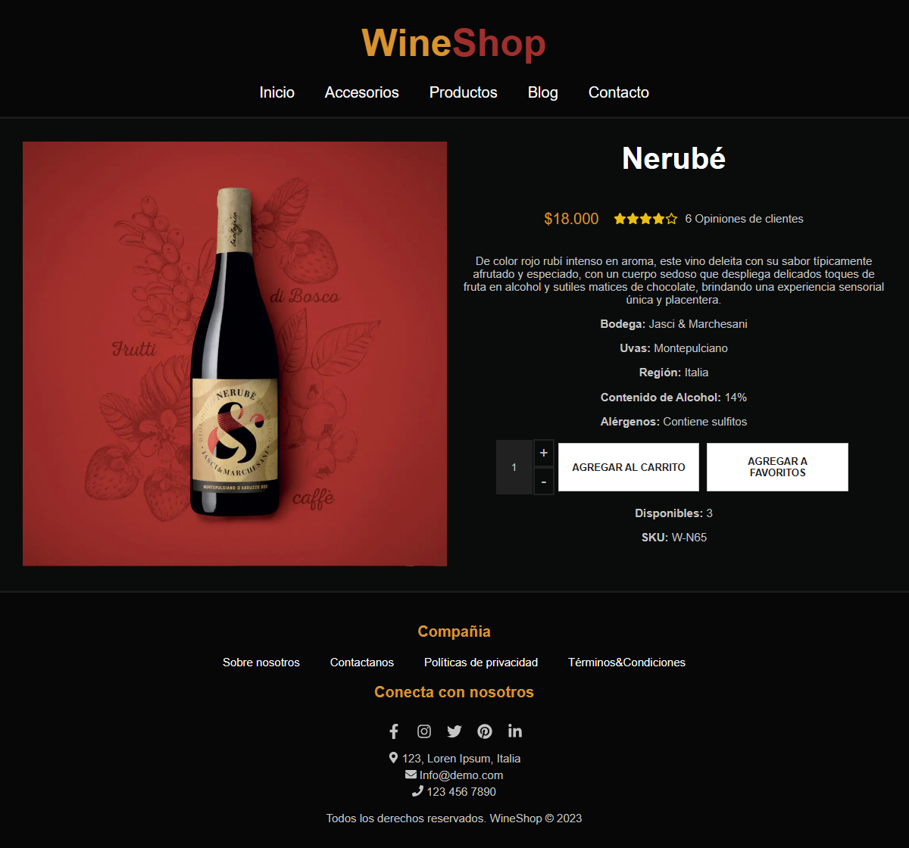

# MyApp

MyApp es una aplicación de una sola página desarrollada en React, diseñada para mostrar detalladamente un único producto. La interfaz minimalista permite a los usuarios explorar la información esencial del producto, incluyendo nombre, descripción, precio, SKU y cantidad disponible. La página es responsive, adaptándose de manera efectiva a diferentes tamaños de pantalla.

## Capturas de Pantalla

## Características Principales
- Presentación detallada de un producto individual.
- Información clara y organizada, incluyendo nombre, descripción, precio, SKU y cantidad disponible.
- Controles de incremento para ajustar la cantidad de productos.
- Botones estáticos para agregar productos al carrito y a favoritos.
- Diseño responsive para una experiencia de usuario óptima en dispositivos móviles y de escritorio.

## Tecnologías Utilizadas
- React: Biblioteca de JavaScript para construir interfaces de usuario.
- CSS: Estilos para personalizar la apariencia y diseño de la aplicación.
- Font Awesome: Biblioteca de íconos utilizada para representar visualmente la calificación del producto.

## Dependencias
- @fortawesome/fontawesome-svg-core
- @fortawesome/free-brands-svg-icons
- @fortawesome/free-regular-svg-icons
- @fortawesome/free-solid-svg-icons
- @fortawesome/react-fontawesome
- react
- react-icons

**Referencias:**
- [React vite Documentation](https://vitejs.dev/)
- [Font Awesome Documentation](https://fontawesome.com/)
- [React Icons Documentation](https://react-icons.github.io/react-icons/)
