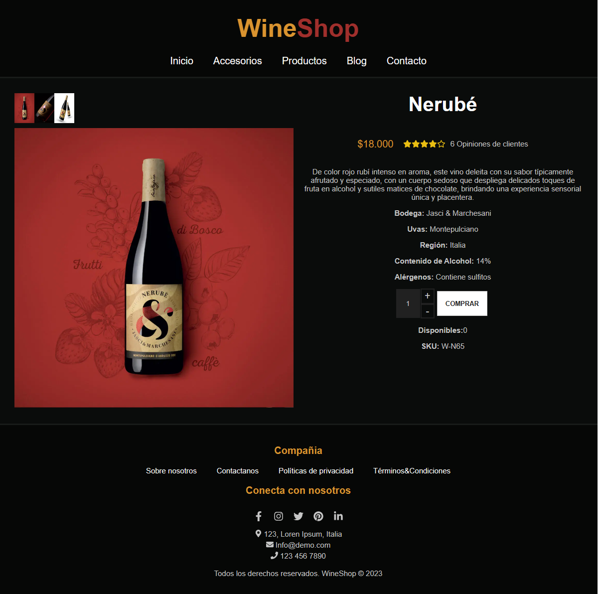

# Proyecto Página de Detalle de Producto

Este proyecto fue desarrollado como parte de un ejercicio práctico en un curso de React de la UTN. La consigna principal fue crear el maquetado de una página de detalle de un producto para un sitio de ecommerce.

## Capturas de Pantalla

## Funcionalidades Implementadas
1. Visualización de Datos:
- Nombre
- Descripción
- Precio
- SKU
- Cantidad disponible

2. Botón "Comprar":
- Al hacer clic en el botón "Comprar", se activa el manejo de estados para mostrar un mensaje al usuario.

3. Manejo de Estados:
- Se utiliza el estado para controlar la disponibilidad del producto y mostrar mensajes al usuario.

## Instrucciones de Uso
1. Clona el repositorio.
2. Navega a la carpeta del proyecto.
3. Ejecuta npm install para instalar las dependencias.
4. Ejecuta npm start para iniciar la aplicación en modo desarrollo.

## Estructura del Proyecto
- src
 - components: Contiene los componentes React.
 - assets: Almacena las imágenes y otros recursos.
 - styles: Archivos de estilos CSS.
 - App.js: Archivo principal de la aplicación.

## Características Principales
- Presentación detallada de un producto individual.
- Información clara y organizada, incluyendo nombre, descripción, precio, SKU y cantidad disponible.
- Controles de incremento para ajustar la cantidad de productos.
- Botones estáticos para agregar productos al carrito y a favoritos.
- Diseño responsive para una experiencia de usuario óptima en dispositivos móviles y de escritorio.

## Tecnologías Utilizadas
- React: Biblioteca de JavaScript para construir interfaces de usuario.
- CSS: Estilos para personalizar la apariencia y diseño de la aplicación.
- Font Awesome: Biblioteca de íconos utilizada para representar visualmente la calificación del producto.

## Dependencias
- @fortawesome/fontawesome-svg-core
- @fortawesome/free-brands-svg-icons
- @fortawesome/free-regular-svg-icons
- @fortawesome/free-solid-svg-icons
- @fortawesome/react-fontawesome
- react
- react-icons

**Referencias:**
- [React vite Documentation](https://vitejs.dev/)
- [Font Awesome Documentation](https://fontawesome.com/)
- [React Icons Documentation](https://react-icons.github.io/react-icons/)

## Agradecimientos
Este proyecto fue realizado como parte de un curso de React, siguiendo la consigna proporcionada por el instructor. Agradecemos la oportunidad de aprender y aplicar los conceptos aprendidos en un proyecto práctico.